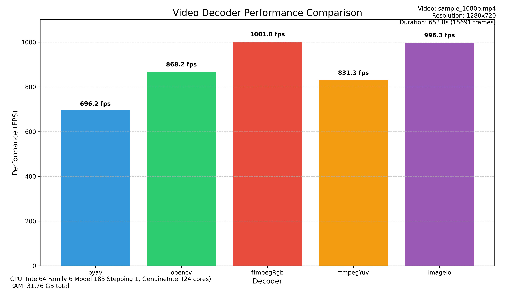

# python-decoders-benchmarks

[](LICENSE)
<!-- Add other relevant badges if applicable -->

A place where one can get guidance on which Python video decoder is best suited for their project based on performance benchmarks.

All benchmarks standardize on `numpy` arrays in RGB24 (C, H, W) format as the final output. Performance measurements include any necessary color space conversions (e.g., BGR→RGB for OpenCV) to ensure fair comparison across all libraries.

## Overview

This project benchmarks the performance (Frames Per Second - FPS) of various Python libraries used for video decoding. The goal is to provide developers with data to make informed decisions when choosing a video decoding backend for their applications.

## Features

*   Benchmarks multiple popular Python video decoding libraries:
    *   [PyAV](https://pyav.org/)
    *   [OpenCV](https://opencv.org/) (via `opencv-python`)
    *   [FFmpeg](https://ffmpeg.org/) (via `subprocess`)
    *   [ImageIO-FFmpeg](https://github.com/imageio/imageio-ffmpeg)
    *   [FFmpegCV](https://github.com/chenxinfeng4/ffmpegcv) (with block and no-block)
    *   [Decord](https://github.com/dmlc/decord) ( not recommended due to [OOM Issues](https://github.com/dmlc/decord/issues/323))
    *   [TorchAudio](https://pytorch.org/audio/stable/index.html) ( requires FFMPEG v6, I can't test it. )
    *   [DeffCode](https://abhitronix.github.io/deffcode/latest/)
    *   [BasswoodAV](https://av.basswood-io.com/docs/stable/) ( pyav continutation )
    *   [Video-Reader-RS](https://github.com/gcanat/video_reader-rs) ( Base run uses pure rgb24 decode afaik whilst the "YuvToRGB" run decodes in yuv420p and then converts it to rgb24 on the rust side to speed things up, altho' I am not entirely sure how this would hold up if the input was in other color formats say yuv422, yuv444 or rgb48 )
    *   [FFmpeg-Python](https://github.com/kkroening/ffmpeg-python) ( Altho' in theory it serves the same purpose as the ffmpeg-subprocess run, I still decided to add it to see if it adds any extra overhead over your run of the mill ffmpeg subprocess pipe )
    *   **Max Theoretical**: Baseline performance using raw `ffmpeg` subprocess ([`decodeWithMaxTheoretical`](src/backends/maxTheoretical.py)) to estimate maximum hardware FPS with minimal overhead for both RGB24 and YUV420p
    *   [Celux](https://github.com/Trentonom0r3/CeLux) ( A new decoder that uses the latest FFmpeg features as well as pytorch to provide high performance async decoding. It is still in early development but shows promising results. )


## Benchmark Results Example


*(Results generated by the benchmark script. Actual performance will vary based on your system hardware and the video file.)*

## Installation

1.  **Clone the repository:**
    ```bash
    git clone https://github.com/NevermindNilas/python-decoders-benchmarks.git
    cd python-decoders-benchmarks
    ```
2.  **Create a virtual environment (recommended):**
    ```bash
    python -m venv venv
    source venv/bin/activate  # On Windows use `venv\Scripts\activate`
    ```
3.  **Install dependencies:**
    ```bash
    pip install -r requirements.txt
    ```
    *Note: Ensure you have FFmpeg installed and accessible in your system's PATH, as several backends depend on it.*

## Usage

Run the main benchmark script ([`main.py`](main.py)) from the root directory:

```bash
python main.py
```

## Contributing

Contributions are welcome! If you want to add another decoder, improve the benchmarking methodology, or fix a bug, please feel free to open an issue or submit a pull request.

## License

This project is licensed under the BSD 3-Clause License - see the [LICENSE](LICENSE) file for details.

## Plans
- Add 1080p benchmarks
- Add a tracker to the GH Runner that keeps track of changes from week to week logging whether the performance of any library has improved or decreased.
