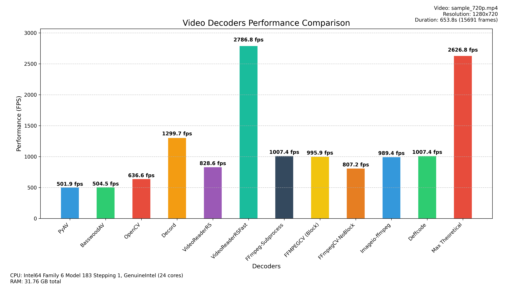

# python-decoders-benchmarks

[](LICENSE)
<!-- Add other relevant badges if applicable -->

A place where one can get guidance on which Python video decoder is best suited for their project based on performance benchmarks.

## Overview

This project benchmarks the performance (Frames Per Second - FPS) of various Python libraries used for video decoding. The goal is to provide developers with data to make informed decisions when choosing a video decoding backend for their applications.

## Features

*   Benchmarks multiple popular Python video decoding libraries:
    *   [PyAV](https://pyav.org/)
    *   [OpenCV](https://opencv.org/) (via `opencv-python`)
    *   [FFmpeg](https://ffmpeg.org/) (via `subprocess`, testing both RGB and YUV raw output)
    *   [imageio-ffmpeg](https://github.com/imageio/imageio-ffmpeg)
    *   [ffmpegcv](https://github.com/chenxinfeng4/ffmpegcv) (with block and no-block)
    *   [decord](https://github.com/dmlc/decord) ( not recommended due to OOM issues )
    *   [torchaudio](https://pytorch.org/audio/stable/index.html) ( requires FFMPEG v6, I can't test it. )

## Benchmark Results Example


*(Results generated by the benchmark script. Actual performance will vary based on your system hardware and the video file.)*

## Installation

1.  **Clone the repository:**
    ```bash
    git clone https://github.com/NevermindNilas/python-decoders-benchmarks.git
    cd python-decoders-benchmarks
    ```
2.  **Create a virtual environment (recommended):**
    ```bash
    python -m venv venv
    source venv/bin/activate  # On Windows use `venv\Scripts\activate`
    ```
3.  **Install dependencies:**
    ```bash
    pip install -r requirements.txt
    ```
    *Note: Ensure you have FFmpeg installed and accessible in your system's PATH, as several backends depend on it.*

## Usage

Run the main benchmark script ([`main.py`](main.py)) from the root directory:

```bash
python main.py
```

## Contributing

Contributions are welcome! If you want to add another decoder, improve the benchmarking methodology, or fix a bug, please feel free to open an issue or submit a pull request.

## License

This project is licensed under the BSD 3-Clause License - see the [LICENSE](LICENSE) file for details.